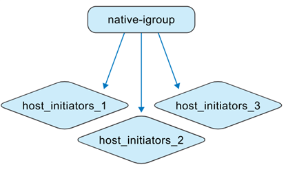
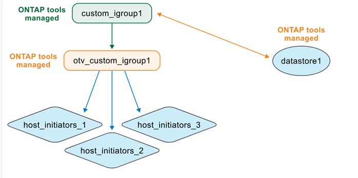

= Comprendre les groupes gérés par les outils ONTAP
:allow-uri-read: 
:icons: font
:imagesdir: ../media/

[role="lead"]
Lors de la gestion des machines virtuelles des outils ONTAP et des systèmes de stockage ONTAP , la compréhension du comportement des groupes d'applications est essentielle, en particulier lors de la migration de banques de données depuis des environnements d'outils non ONTAP vers la gestion des outils ONTAP . Cette section décrit comment les igroups sont mis à jour pendant cette transition.

Les ONTAP tools for VMware vSphere 10.4 simplifient la gestion des banques de données en automatisant la création et la maintenance des objets ONTAP et vCenter dans les environnements de centre de données VMware.

Les ONTAP tools for VMware vSphere 10.4 interprètent les igroups dans deux contextes différents :

.igroups gérés par des outils non ONTAP
En tant qu'administrateur de stockage, vous pouvez créer des igroups sur le système ONTAP sous forme de structures plates ou imbriquées. L'illustration montre un igroup plat créé dans le système ONTAP .

.igroups gérés par les outils ONTAP
Lorsque vous créez des banques de données, les ONTAP tools for VMware vSphere 10.4 créent automatiquement des igroups à l'aide d'une structure imbriquée pour un mappage LUN plus facile.

Par exemple, lorsque datastore1 est créé et monté sur les hôtes 1, 2 et 3, et qu'un nouveau datastore (datastore2) est créé et monté sur les hôtes 3, 4 et 5, les outils ONTAP réutilisent le groupe i au niveau de l'hôte pour une gestion efficace.

image:../media/otv-managed.png["Outils ONTAP gérés par igroup"]

image:../media/otv-managed2.png["Outils ONTAP gérés par igroup avec igroup enfant réutilisé"]

Voici quelques cas d' ONTAP tools for VMware vSphere .

*Lorsque vous créez une banque de données avec les paramètres igroup par défaut*

Lorsque vous créez une banque de données et laissez le champ igroup vide (paramètre par défaut), les outils ONTAP génèrent automatiquement une structure igroup imbriquée pour cette banque de données. Le groupe parent au niveau du magasin de données est nommé à l'aide du modèle : otv_<vcguid>_<host_parent_datacenterMoref>_<datastore_name>. Chaque groupe enfant au niveau de l'hôte suit le modèle : otv_<hostMoref>_<vcguid>. Vous pouvez afficher l'association entre les groupes parents (au niveau du magasin de données) et enfants (au niveau de l'hôte) dans la section *Groupe d'initiateurs parents* de l'interface de stockage ONTAP .

Avec l’approche igroup imbriquée, les LUN sont mappés uniquement aux igroups enfants. L’inventaire vCenter Server affiche ensuite la nouvelle banque de données.

*Lorsque vous créez une banque de données avec un nom de groupe i personnalisé*

Lors de la création d'une banque de données dans les outils ONTAP , vous pouvez saisir un nom de groupe d'applications personnalisé au lieu de le sélectionner dans la liste déroulante. Les outils ONTAP créent ensuite un groupe parent au niveau du magasin de données en utilisant le nom que vous avez spécifié. Si le même hôte est utilisé pour plusieurs banques de données, le groupe i existant au niveau de l'hôte (enfant) est réutilisé. Par conséquent, le LUN du nouveau magasin de données est mappé à ce groupe i enfant existant, qui peut désormais être associé à plusieurs groupes i parents (un pour chaque magasin de données). La liste des banques de données de l'interface utilisateur de vCenter Server confirme la création réussie de la nouvelle banque de données avec le nom igroup personnalisé.

*Lorsque vous réutilisez le nom du groupe i lors de la création du magasin de données*

Lors de la création d'une banque de données à l'aide de l'interface utilisateur des outils ONTAP , vous pouvez choisir un groupe parent personnalisé existant dans la liste déroulante. Après avoir réutilisé le groupe parent pour créer une autre banque de données, l'interface utilisateur des systèmes ONTAP affiche cette association. Le nouveau magasin de données apparaît également dans l’interface utilisateur de vCenter Server.

Cette opération peut également être effectuée à l’aide de l’API. Pour réutiliser un igroup existant lors de la création d'une banque de données, spécifiez l'UUID igroup dans la charge utile de la demande d'API.

*Lorsque vous créez un datastore et un igroup nativement à partir ONTAP et de vCenter*

Si vous créez l'igroup et le datastore directement dans les systèmes ONTAP et les environnements VMware, les outils ONTAP ne gèrent pas ces objets dans un premier temps. Cela crée une structure igroup plate.

image:../media/vmfsds-native.png["Datastore et igroup créés nativement"]

Pour gérer une banque de données et un groupe d'applications existants avec les outils ONTAP , vous devez effectuer une découverte de banque de données. Les outils ONTAP identifient et enregistrent le magasin de données et l'igroup, et les convertissent en une structure imbriquée dans sa base de données. Un nouveau groupe parent est créé en utilisant le nom personnalisé, tandis que le groupe existant est renommé avec le préfixe « otv_ » et devient le groupe enfant. Les mappages d’initiateurs restent inchangés. Seuls les igroups mappés aux banques de données sont convertis lors de la découverte. Après cela, la structure igroup ressemble à l’illustration ci-dessous.

Vous pouvez créer une banque de données directement dans vCenter Server et la placer ultérieurement sous la gestion des outils ONTAP . Tout d’abord, créez un igroup plat dans les systèmes ONTAP et mappez-y un LUN. Après avoir exécuté la découverte de banque de données dans les outils ONTAP , le groupe i plat est converti en une structure imbriquée. Les outils ONTAP gèrent ensuite l'igroup, en le renommant avec le préfixe « otv_ ». Le LUN reste mappé au même igroup tout au long de ce processus.

*Comment les outils ONTAP réutilisent les igroups créés nativement*

Vous pouvez provisionner une banque de données dans les outils ONTAP à l'aide d'un igroup créé à l'origine dans les systèmes ONTAP , après sa gestion par les outils ONTAP . Ces groupes i apparaissent dans la liste déroulante des noms de groupe d'initiateurs personnalisés. Le nouveau LUN pour le magasin de données est ensuite mappé au groupe enfant normalisé correspondant, tel que « otv_NativeIgroup1 ».

Les ONTAP tools for VMware vSphere ne détectent ni n'utilisent les igroups créés dans le système ONTAP qui ne sont pas gérés par les outils ONTAP ou liés à une banque de données.
